Tutorial 03 - UART1, Auxilary mini UART
=======================================

'Hello World'로 유명한 예제입니다. UART1(Auxilary mini UART)는 고정 클럭 주파수를 가지고 있기 때문에 프로그래밍 하기가 더 쉬어 UART1에 먼저 출력을 할 것입니다.

참고: QEMU는 기본적으로 UART1을 터미널로 리다이렉션하지 않고 UART0만 리다이렉션 하므로, `-serial null -serial stdio`를 사용해야 합니다.

gpio.h
------

새로운 헤더 파일이 있습니다. 기본 MMIO 주소와 GPIO 컨트롤러 주소를 정의합니다. 이 파일은 많은 장치에서 필요하므로 매우 중요합니다.

uart.h
------

아주 최소한의 UART 구현이 되어있습니다.

`uart_init()` 장치를 초기화하고, GPIO 포트에 매핑합니다.

`uart_send(c)` Serial을 통하여 문자를 보냅니다.

`uart_getc()` 캐릭터를 받습니다. 캐리지 리턴 문자(13)은 줄 바꾸기 문자(10)으로 변환됩니다.

`uart_puts(s)` 문자열을 출력합니다. 줄 바꿈에서 캐리지 리턴 문자도 전송됩니다. (13 + 10)

uart.c
------

- `uart_init()` : UART 초기화
  1. `AUX_ENABLE` Register의 `0`번 비트(Mini UART enable)를 `1`로 설정하여 UART1(AUX mini UART)를 활성화 합니다.  
  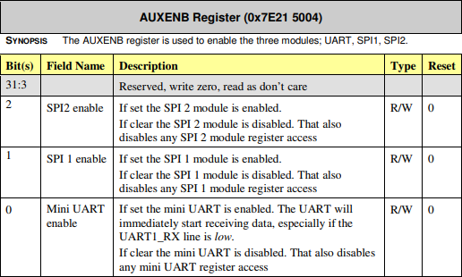
  2. `AUX_MU_CNTL` Register의 모든 비트를 `0`으로 설정합니다. Tx, Rx가 비활성화 됩니다.  
  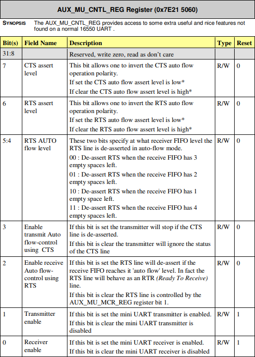
  3. `AUX_MU_LCR` Register의 [`1`:`0`] 비트를 `11`으로 설정하여 8-bit mode를 사용하도록 설정합니다.  
  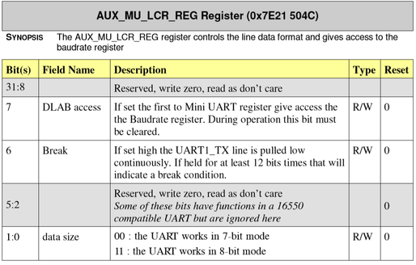
  4. `AUX_MU_MCR` Register의 모든 비트를 `0`으로 설정합니다.  
  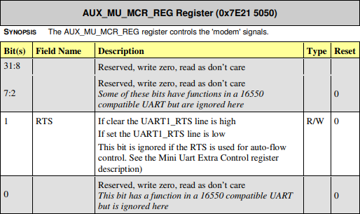
  5. `AUX_MU_IER` Register의 모든 비트를 `0`으로 설정합니다.  
  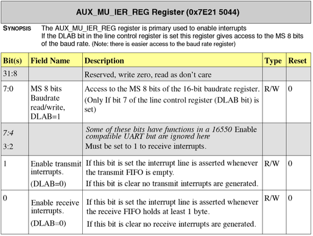
  6. `AUX_MU_IIR` Register를 `0xc6`(`11000001`)으로 설정하여 Interrupt를 비활성화 합니다.  
  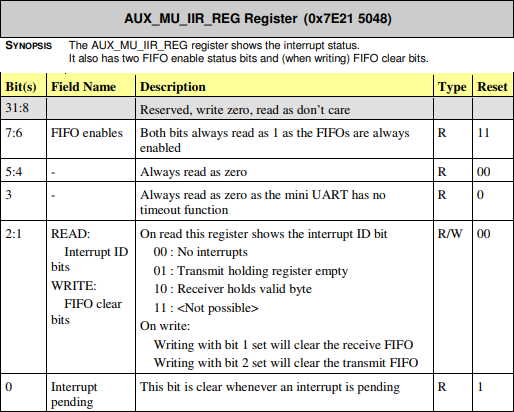
  7. `AUX_MU_BAUD` Register를 `270`으로 설정하여 전송속도를 115200로 설정합니다.  
  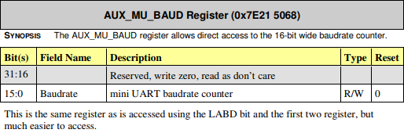
    - baudrate = system_clock_freq / 8 * (baudrate_reg + 1)
    - *baudrate_reg 계산 방법:*
      - baudrate_reg = (system_clock_freq / 8 * baudrate) - 1
      - baudrate_reg = (250000000 / 8 * 115200) - 1 = 270.267‥ ≈ 270
  8. `GPFSEL1` Register에서 GPIO 14, 15 Pin을 ‘Alternate function 5’로 설정합니다.  
  'Alternate function 5'로 설정하는 이유는 [BCM2837-ARM-Peripherals-Revised-V2-1.pdf](https://raw.githubusercontent.com/LeeKyuHyuk/Raspberry-Pi-Bare-Metal/raspberry-pi-3/Documentation/BCM2837-ARM-Peripherals-Revised-V2-1.pdf)의 102페이지 'Alternative Function Assignments'를 참고하세요.  
  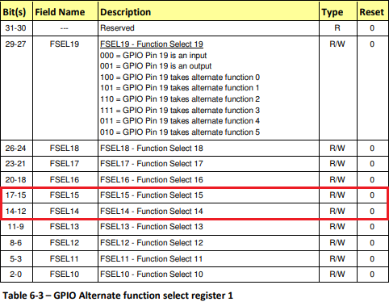
  9. `GPPUD` Register의 [`1`:`0`]을 `00`으로 설정합니다.  
  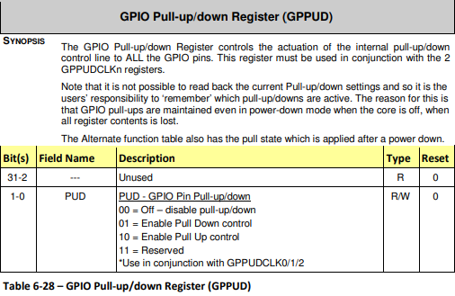
  10. `GPPUDCLK0` Register에서 `14`, `15번` 비트를 `1`로 설정합니다.  
  (GPIO Pin 14, 15를 Assert Clock on line으로 만듭니다)  
  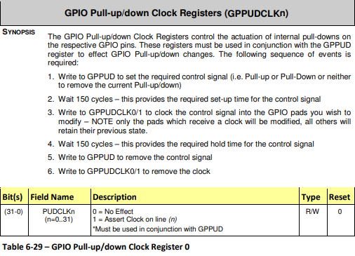
  11. `GPPUDCLK0` Register를 `0`으로 설정하여, 모든 GPIO Pin을 No Effect로 만듭니다.
  > 코드에는 150 Cycle을 대기하는 구문이 있습니다. `GPPUDCLKn`의 *SYNOPSIS*를 보면 왜 150 Cycle을 대기해야 하는지 설명이 나와 있습니다.
  12. `AUX_MU_CNTL` Register의 `0`, `1`번 비트를 `1`로 설정하여 Tx, Rx를 활성화 합니다.
  

- `uart_init()` : 문자 보내기
  1. `AUX_MU_LSR` Register의 5번째 비트인 ‘Transmitter Empty’를 확인합니다.  
  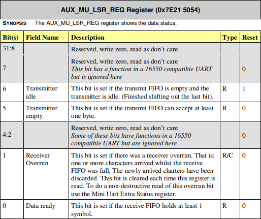
  2. ‘Transmitter Empty’가 1이면 `AUX_MU_IO` Register에 Data를 넣어 Buffer에 문자를 기록합니다.  
  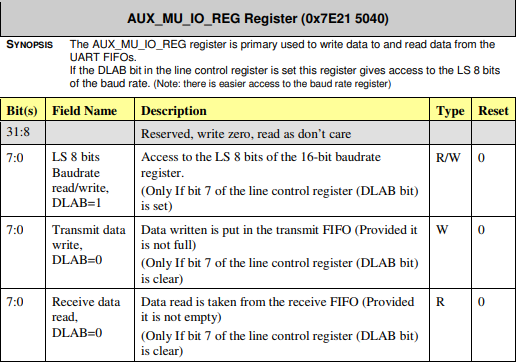

- `uart_getc()` : 문자 받기
  1. `AUX_MU_LSR` Register의 1번째 비트인 ‘Data ready’를 확인합니다.  
  
  2. ‘Data ready’가 1이면 `AUX_MU_IO` Register의 Data를 읽어 반환합니다.  
  

Main
----

먼저 UART 초기화 코드를 호출합니다. 그리고 "Hello World!"를 출력합니다. USB Serial 케이블을 구입한 경우 minicom 화면에 표시됩니다. minicom에 입력된 모든 문자가 다시 출력(Echo) 됩니다. Local Echo를 끄지 않은 경우, 누른 키를 두 번 볼 수 있습니다.
